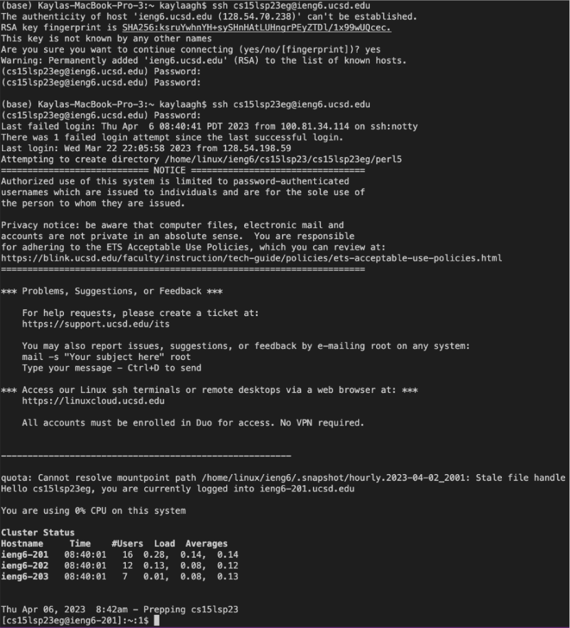
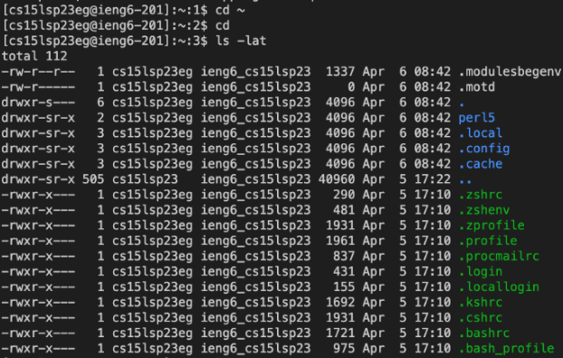

# Getting Set Up!
---
*Today we will focus on:*
```
1. Getting Your CSE15L Account   
2. Downloading Visual Studio Code
3. Remotely Connecting 
4. Running Some Commands 
``` 
---
## **Part 1: Getting Your CSE15L Account**
- Step 1: Lookup your course specific account by logging in, using this [link](https://sdacs.ucsd.edu/~icc/index.php)
- Step 2: Follow the instructions on this [page](https://drive.google.com/file/d/17IDZn8Qq7Q0RkYMxdiIR0o6HJ3B5YqSW/view) to reset your password. Once you are finished, you can move on to the next part!
---

## **Part 2: Downloading Visual Studio Code**
- Step 1: Go to the Visual Studio Code [Website](https://code.visualstudio.com/) 
- Step 2: Click on the download button up on the top right and follow the instructions to download/install it on your computer (make sure to click on the right link based on what kind of computer you have)
- Step 3: Open the application once it is done installing. It should look something like this
 
---

## **Part 3: Remotely Connecting**
- Step 1: Open your VS Code terminal 
 
  It should look something like this. If you cannot find it, it may be hidden. On the bottom left corner, click on the circle with an x in the middle. This   should pop up a menu where you can then click on terminal. 
  
- Step 2: Checking for Git

  If you are a mac user, skip this step. For Windows users, install `git` for [Windows](https://gitforwindows.org/). Once installed, follow the               instructions on this [Link](https://stackoverflow.com/questions/42606837/how-do-i-use-bash-on-windows-from-the-visual-studio-code-integrated-terminal/50527994#50527994) to set your default terminal to use `git-bash` in VS Code. Next, open a terminal in VS Code to use `ssh`. 
  
- Step 3: Connecting 

  Once your terminal is open, run this command `$ ssh cs15lsp23zz@ieng6.ucsd.edu`. Replace the `zz` with the letters in your course-specific account. Remember that the `$` sign should NOT be typed in!
  
  After running the command, you might see something like this (if it's your first time)
  ```
  ⤇ ssh cs15lsp23zz@ieng6.ucsd.edu
  The authenticity of host 'ieng6.ucsd.edu (128.54.70.227)' can't be established.
  RSA key fingerprint is SHA256:ksruYwhnYH+sySHnHAtLUHngrPEyZTDl/1x99wUQcec.
  Are you sure you want to continue connecting (yes/no/[fingerprint])? 
  ```
  Don't worry, this is normal. Just type `yes` and press enter, then give it your password! It should look something like this:
  ```
  # On your client
  ⤇ ssh cs15lsp23zz@ieng6.ucsd.edu
  The authenticity of host 'ieng6-202.ucsd.edu (128.54.70.227)' can't be established.
  RSA key fingerprint is SHA256:ksruYwhnYH+sySHnHAtLUHngrPEyZTDl/1x99wUQcec.
  Are you sure you want to continue connecting (yes/no/[fingerprint])? 
  Password: 
  ```
  ```
  # Now on remote server
  Last login: Sun Jan  2 14:03:05 2022 from 107-217-10-235.lightspeed.sndgca.sbcglobal.net
  quota: No filesystem specified.
  Hello cs15lsp23zz, you are currently logged into ieng6-203.ucsd.edu

  You are using 0% CPU on this system

  Cluster Status 
  Hostname     Time    #Users  Load  Averages  
  ieng6-201   23:25:01   0  0.08,  0.17,  0.11
  ieng6-202   23:25:01   1  0.09,  0.15,  0.11
  ieng6-203   23:25:01   1  0.08,  0.15,  0.11

  Sun Jan 02, 2022 11:28pm - Prepping cs15lsp23
  ```
  **OR THIS**
  
  
  
  Once you successfully log in, your terminal will now be connected to a computer in the CSE basement! So any commands you   run will run on that computer. Your computer is the *client* and the computer in the basement is the *server*.
 
---

## **Part 4: Run Some Commands**
- Step 1: Running Commands
 There are infinite amount of commands we can run. Try running the commands `cd`, `ls`, `pwd`, `mkdir`, and `cp` a few times to see what happens! Here are some other commands you can try as well:
 
  `cd ~`
  
  `cd`
 
  `ls`
 
  `ls -a`
 
  `ls -lat`
 
  `ls <directory>`
 
  `cp /home/linux/ieng6/cs15lsp23/public/hello.txt ~/`
 
  `cat /home/linux/ieng6/cs15lsp23/public/hello.txt`

  Here are some examples of running a few of the commands!
  
  
 
  Once you are done, you can log out of the remote server by using `Ctrl-D` or run the command `exit`.
