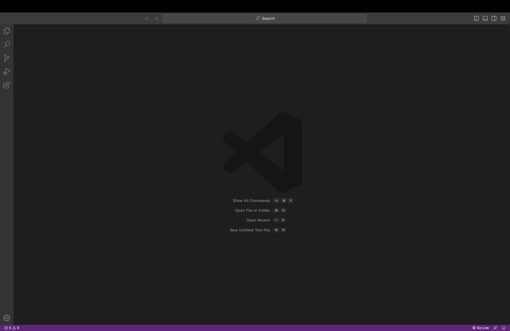
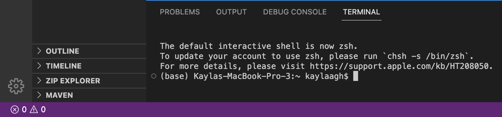

# Getting Set Up!
---
*Today we will focus on:*
```
1. Downloading Visual Studio Code
2. Remotely Connecting 
3. Running Some Commands 
``` 
---
## **Part 1: Downloading Visual Studio Code**
- Step 1: Go to the Visual Studio Code [Website](https://code.visualstudio.com/) 
- Step 2: Click on the download button up on the top right and follow the instructions to download/install it on your computer (make sure to click on the right link based on what kind of computer you have)
- Step 3: Open the application once it is done installing. It should look something like this
 

## **Part 2: Remotely Connecting**
- Step 1: Open your VS Code terminal 
 
  It should look something like this. If you cannot find it, it may be hidden. On the bottom left corner, click on the circle with an x in the middle. This   should pop up a menu where you can then click on terminal. 
- Step 2: Checking for Git
  If you are a mac user, skip this step. For Windows users, install `git` for [Windows](https://gitforwindows.org/). Once installed, follow the               instructions on this [Link](https://stackoverflow.com/questions/42606837/how-do-i-use-bash-on-windows-from-the-visual-studio-code-integrated-      terminal/50527994#50527994) to set your default terminal to use `git-bash` in VS Code.
  
  

  
## **Part 3: Running Some Commands**


`Click this` [Link](https://code.visualstudio.com/)	`to learn more about the dog!`

```
Golden Doodles are my favorite dog breed. 
```
 
