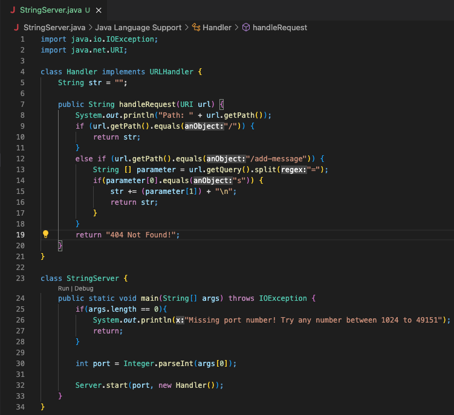
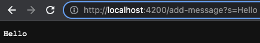
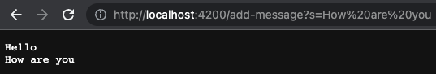
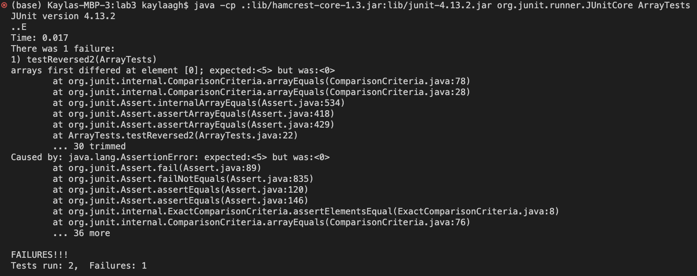

# Lab Report 2 - Servers and Bugs
---
*Today we will focus on:*
```
1. Writing a Web Server 
2. Explaining Bugs
3. Something I Learned
``` 
---

## **Part 1: Writing a Web Server**
- Code for StringServer:



- Screenshots Using  `/add-message`:

`/add-message?s=Hello`



**Questions:** 
- The `getPath()` and `getQuery()` method are both called as well as the built-in `.equals()` method
- The relevenat arguments for path include everying past the forward slash `/` while the relevant arguments for query gets split between the equal sign, `args[0]` is "s" while `args[1]` is the string you want to print out which is in this case "Hello".
- In NumberServer.java we were incrementing numbers which uses ints. In StringServer.java we are printing out Strings that the user wants to display. They both add the message or number everytime that it gets run again so that the message is displayed after the previous one or the number gets added to the total from before. 


`/add-message?s=How are you`



**Questions:** 
- The `getPath()` and `getQuery()` method are both called as well as the built-in `.equals()` method
- The relevenat arguments for path include everying past the forward slash `/` while the relevant arguments for query gets split between the equal sign, `args[0]` is "s" while `args[1]` is the string you want to print out which is in this case "How are you".
- In NumberServer.java we were incrementing numbers which uses ints. In StringServer.java we are printing out Strings that the user wants to display. They both add the message or number everytime that it gets run again so that the message is displayed after the previous one or the number gets added to the total from before. 

---

## **Part 2: Explaining Bugs**
- A failure inducing input:
```
@Test 
public void testReversed2() {
  int [] input2 = {1, 2, 3, 4, 5};
  assertArrayEquals(new int {5, 4, 3, 2, 1}, ArrayExamples.reversed(input2));
}
```
- An input that doesn't induce a failure
```
@Test 
public void testReversed2() {
  int [] input = { 3 };
  assertArrayEquals(new int { 3 }, ArrayExamples.reversed(input));
}
```
- The Symptom


- The Bug
 
  Before:
  ```
  static int[] reversed(int[] arr) {
    int[] newArray = new int[arr.length];
    for(int i = 0; i < arr.length; i += 1) {
      arr[i] = newArray[arr.length - i - 1];
    }
    return arr;
  }
  ```
  After:
  ```
   static int[] reversed(int[] arr) {
    int[] newArray = new int[arr.length];
    for(int i = 0; i < arr.length; i += 1) {
      newArray[arr.length - i - 1] = arr[i];
    }
    return newArray;
  }
  ```
  Explanation:
  
  Before fixing the bug, it was returning the old array "arr" when we want to return the new array "newArray". Swaping the "arr" to "newArray" in the return statement would fix the problem of returning the new array. The other problem in reversed was in the for loop where it was setting all the values of the new array to 0. To fix this, you need to swap the order inside the loop to newArray[arr.length - i - 1] = arr[i] so that it would return the input in reversed order. The reason why the one test didn't fail was because there was only one number so the reversed order would be the same as the input no matter what.
  
---

## **Part 3: Something I Learned**

Something I learned from this weeks lab is that in order to access juint on vs code, you have to run a pretty specific command unlike what we do in CSE 12 where we just click the run button. It's more tedious on vs code but you end up with the same outputs. 
