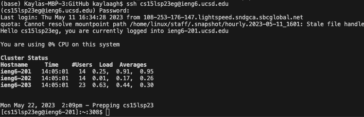
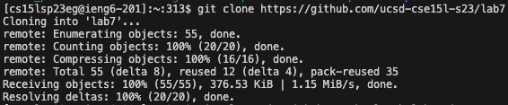

# Lab Report 4 - Reproducing Tasks 
---
*Today we will focus on:*
```
1. Logging into ieng6
2. Clone your fork of the repository from your Github account
3. Run the tests, demonstrating that they fail
4. Edit the code file to fix the failing test
5. Run the tests, demonstrating that they now succeed
6. Commit and push the resulting change to your Github account (you can pick any commit message!)
``` 
---

## **Part 1: Logging into ieng6**

- Screenshot:


  


- Keys Pressed: 
  1. ssh <space> cs15lsp23eg<shift+2>@ieng6.ucsd.edu <enter>
  2. enter password


- Summary:


---

## **Part 2: Clone your fork of the repository from your Github account**

- Screenshot:
  
  

- Keys Pressed: 
  
  git <space> clone <space> <command+v>

- Summary:
  
  ---

## **Part 3: Run the tests, demonstrating that they fail**

- Screenshot:
  
  

- Keys Pressed: 
  
  1. cd <space> lab7 <enter>
  2. vim <space> <shift+l>List<shift+e>Examples<shift+t>Tests.java <enter>

- Summary:
