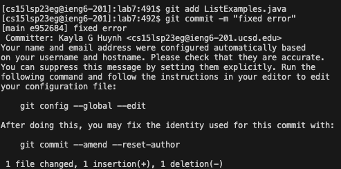

# Lab Report 4 - Reproducing Tasks 
---
*Today we will focus on:*
```
1. Logging into ieng6
2. Clone your fork of the repository from your Github account
3. Run the tests, demonstrating that they fail
4. Edit the code file to fix the failing test
5. Run the tests, demonstrating that they now succeed
6. Commit and push the resulting change to your Github account (you can pick any commit message!
``` 
---

## **Part 1: Logging into ieng6**

- Screenshot:


  


- Keys Pressed: 
  1. `ssh <space> cs15lsp23eg<shift+2>@ieng6.ucsd.edu <enter>`


- Summary: I just ssh'd into my 15l account without having to put in my password because of the generated key. 


---

## **Part 2: Clone your fork of the repository from your Github account**

- Screenshot:
  
  

- Keys Pressed: 
  
  1. `git <space> clone <space> <command+v>`

- Summary: I used the commang git clone in order to clone the repository into my account. 
  
---

## **Part 3: Run the tests, demonstrating that they fail**

- Screenshot:
  
  

- Keys Pressed: 
  
  1. `cd <space> lab7 <enter>`
  2. `ls <enter>`
  3. `<ctrl+r> javac -cp .:lib/hamcrest-core-1.3.jar:lib/junit-4.13.2.jar ListExamplesTests.java <enter>`
  4. `<ctrl+r> java -cp .:lib/hamcrest-core-1.3.jar:lib/junit-4.13.2.jar org.junit.runner.JUnitCore ListExamplesTests <enter>`
  

- Summary: I used cd to go into the lab7 repo and then used ls to see what files i was working with. Then I used ctrl-r to reverse search my bash history so that i didnt have to write out the whole javac/java command to run the tests and showed that they failed. 
  
  ---

## **Part 4: Edit the code file to fix the failing test**
  
- Screenshot:
  
  

- Keys Pressed: 
  
  1. `vim <space> <shift+l>List<shift+e>Examples.java<enter>`
  2. `<shift+;> :44 <enter>`
  3. `lllll`
  4. `r<2>`
  5. `<shift+;> :wq <enter>`
  

- Summary: I entered the file using vim and then used :44 to get to the line i needed to fix and then used r to replace the 1 with 2 and then used :wq to save my edits. 
  
## **Part 5: Run the tests, demonstrating that they now succeed**

- Screenshot:
  
  

- Keys Pressed: 
 
  1. `<ctrl+r> javac -cp .:lib/hamcrest-core-1.3.jar:lib/junit-4.13.2.jar ListExamplesTests.java <enter>`
  2. `<ctrl+r> java -cp .:lib/hamcrest-core-1.3.jar:lib/junit-4.13.2.jar org.junit.runner.JUnitCore ListExamplesTests <enter>`
  

- Summary: I used ctrl-r to reverse search my bash history so that i didnt have to write out the whole javac/java command to run the tests and showed that they succeeded.
  
  ---
  
## **Part 6: Commit and push the resulting change to your Github account (you can pick any commit message!**

- Screenshot:
  
  
  

- Keys Pressed: 
 
  1. `git <space> add ListExamples.java <enter>`
  2. `git <space> commit -m "fixed error" <enter>`
  3. `git <space> push <enter>`
  

- Summary: I used the git add command to save save my changes that i made and then git commit to commit the changes too with the message "fixed error". Then I used git push in order to push the changes to the repo.
