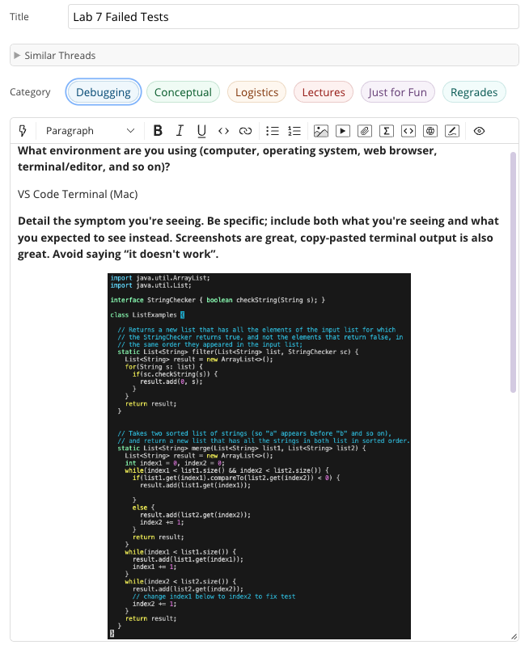

# Lab Report 5 - Debugging and Reflection 
---
*Today we will focus on:*
```
1. A Debugging Scenario
2. Course Reflection
``` 
---

## **Part 1: Debugging Scenario**
**1. EdStem Post:** 

  

**2. TA Response**

Hi! It looks like the issue involves the JUit package in VS Code. Since JUnit is an external library it requires some special     commands in order for it to compile properly. Have you tried using the -cp commands? If not, they are listed below:

`javac -cp .:lib/hamcrest-core-1.3.jar:lib/junit-4.13.2.jar *.java`
   
`java -cp .:lib/hamcrest-core-1.3.jar:lib/junit-4.13.2.jar org.junit.runner.JUnitCore ListExamplesTests`

Good Luck editing!

**3. Edit**

Output:
    

Bug:

It looks like the bug involved not using the right command in order to run JUnit. The command that triggered the bug was 
`javac ListExamplesTests.java`. Like the TA said, JUnit is an external library so we had to run a special command in order to run the program. Using the javac -cp and java -cp commands worked and allowed us to check if the tests passed, which they both did. This might of happened since in CSE 11 we didnt use the -cp part. 


**4. Setup**
- File and Directory Structure: This repo was the lab7 one and I used ListExamplesTests.java to showcase the debugging scenario. 
- Contents: I didnt change any contents of the file itself since it was a problem in the command line.
- Command that triggred the bug: `javac ListExamplesTests.java`
- What I did to fix the bug: I did what the TA said and ran javac ande java with the -cp part in order to run JUnit properly. 

---

## **Part 2: Reflection**
Something I learned in the second half of the quarter is how autograder works on the backend. In lab 6 and 8 we had to create a bash script that would check to see if different files of code would pass the grader which was a cool thing to program since we use it so often in CSE 12. 
