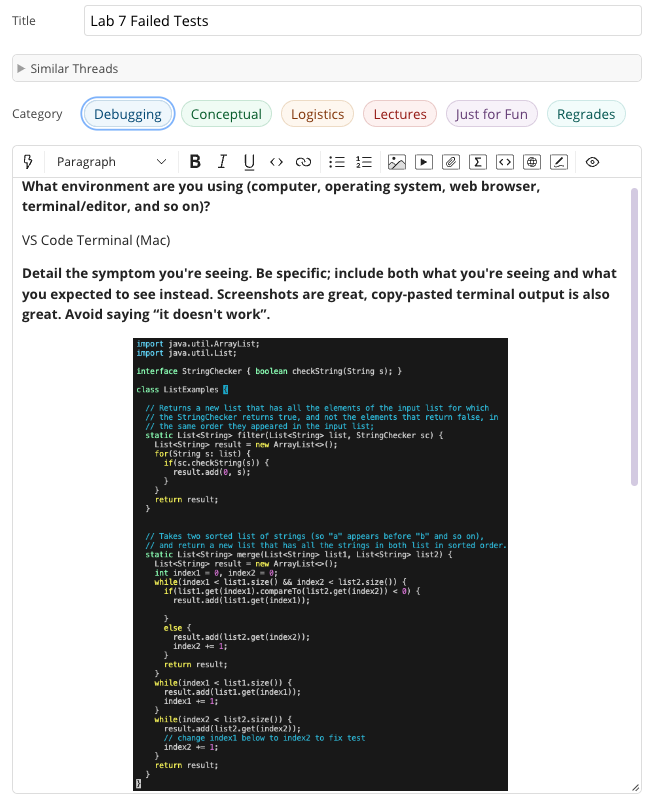
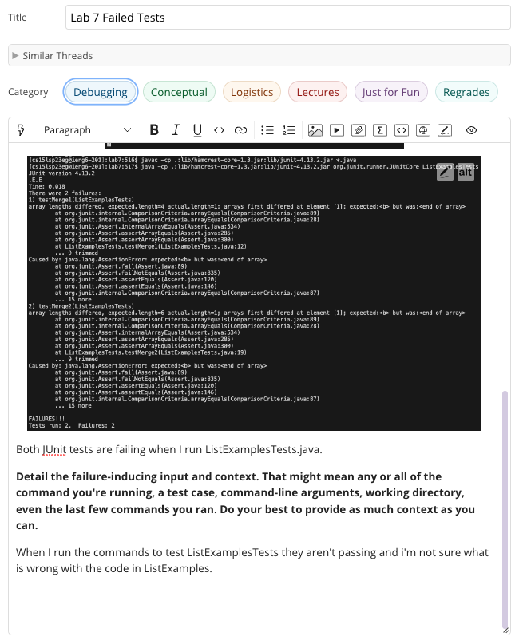
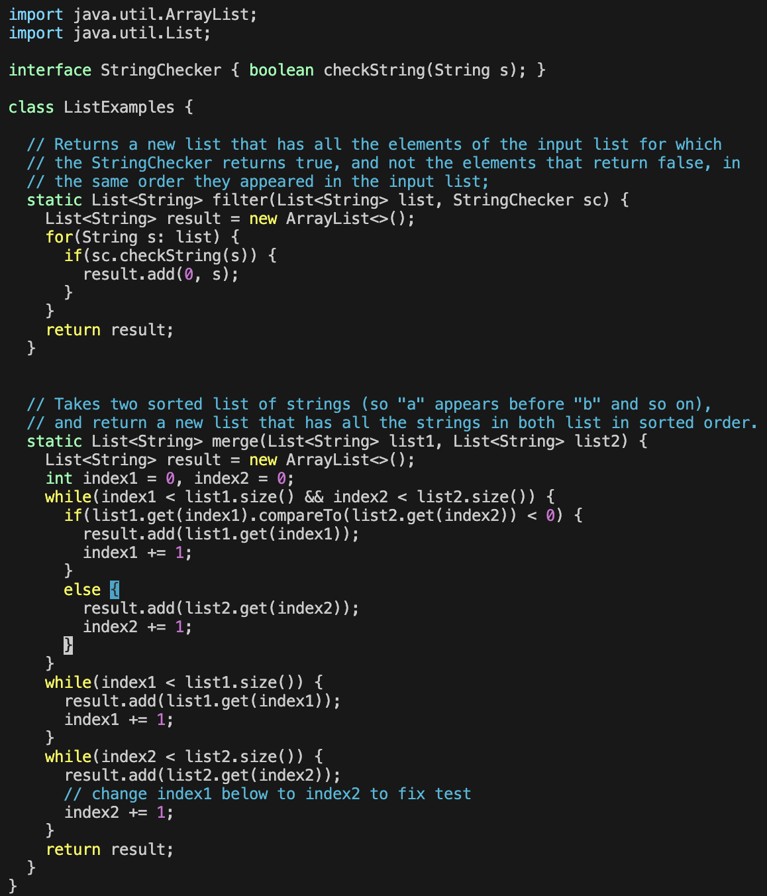
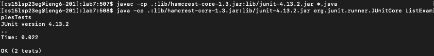

# Lab Report 5 - Debugging and Reflection 
---
*Today we will focus on:*
```
1. A Debugging Scenario
2. Course Reflection
``` 
---

## **Part 1: Debugging Scenario**
**1. EdStem Post:** 

  
  

**2. TA Response**

Hi! It looks like the issue is within the `ListExamples.java` file that is causing an `AssertionError`. It also seems like you are returning the `result` twice which should only be returned at the end. Have you tried lookiing at that? Also it looks like the `if` statement in the `merge` method is missing a key thing. Hava a look at those two things out and then run the -cp commands again to see if that changes anything. Good Luck editing!

**3. Edit**

Fixed Code:



Output:



Bug:

It looks like the bug involved returning the `result` of merge twice. So I deleted the one after the `if` statement and then realized that I was also missing `index1 += 1;` within the if statement as well that fixed the `AssertionError`. Changing these two things made both of the tests pass so the TA was right about my errors. 


**4. Setup**
- File and Directory Structure: This repo was the lab7 one and I used ListExamples.java to showcase the debugging scenario. 
- Contents: The contents before I fixed the bug is attached in the edStem post.
- Command that triggred the bug: The javac -cp and java -cp commands which triggered the bug since it was running the tests.
- What I did to fix the bug: I did what the TA said and fixed the mistakes of returning the result and if statement. 

---

## **Part 2: Reflection**
Something I learned in the second half of the quarter is how autograder works on the backend. In lab 6 and 8 we had to create a bash script that would check to see if different files of code would pass the grader which was a cool thing to program since we use it so often in CSE 12. 
