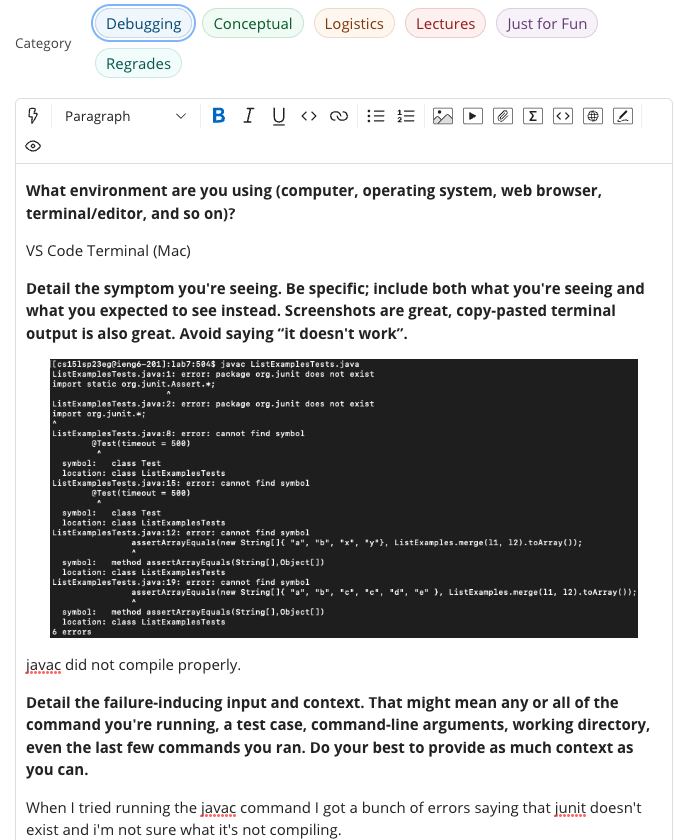

# Lab Report 5 - Debugging and Reflection 
---
*Today we will focus on:*
```
1. A Debugging Scenario
2. Course Reflection
``` 
---

## **Part 1: Debugging Scenario**
**1. EdStem Post:** 

  

**2. TA Response**
  - Hi! It looks like the issue involves a typo, causing javac not to compile correctly. Have you considered checking if "indexr" on line 44 is typed correctly? Good Luck editing!

**3. Edit**

Output:
    

Bug:

It looks like the bug was a typo, just like what the TA said. When editing index1 to index2 i used the ctrl-r to replace the number but instead of pressing 2 I accidently pressed 'r' two times giving me indexr which ultimately caused javac not to run correctly. 
